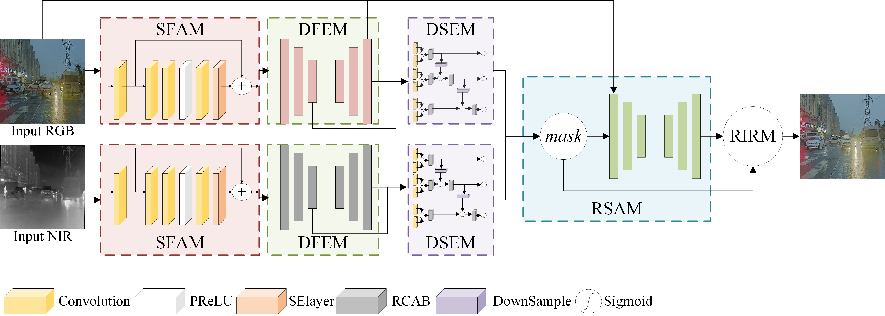

# MRIP-Net 🚀

Code for the paper: **Multi-modal Image Reflection Removal with Prior Knowledge of Reflection Structure Inconsistency**

## 📜 Abstract
When capturing images through transparent media such as glass, unwanted reflections can significantly affect image clarity and information accuracy. To address this issue, we propose the **Multi-modal Reflection-structure Inconsistency Prior Network (MRIP-Net)**, which leverages prior knowledge of reflection structure inconsistency to effectively integrate RGB and near-infrared (NIR) image information, enhancing image reflection removal performance.

MRIP-Net features:
- **Shallow Feature Acquisition Module (SFAM)**
- **Deep Feature Encoding Module (DFEM)**
- **Reflection Suppression Attention Mechanism (RSAM)**

Through multi-level feature extraction, fusion, and reconstruction, MRIP-Net generates high-quality reflection-free images. Additionally, we have constructed a new multi-modal RGB-NIR image reflection removal dataset (MIRR dataset), providing a reliable benchmark for research and evaluation of image reflection removal algorithms. Experimental results show that MRIP-Net significantly outperforms other methods in the image reflection removal task.



## 📂 Resources

- **MIRR Dataset**: [Download here](https://mcmasteru365-my.sharepoint.com/:u:/g/personal/liu2259_mcmaster_ca/EdUamCz1XgxNrqeTTltZSiQBOkxd3QzLpnPI649ho2_xqw?e=wZldeh)
- **MRIP-Net Pretrained Model**: [Download here](https://mcmasteru365-my.sharepoint.com/:u:/g/personal/liu2259_mcmaster_ca/Ee6ThE1CYdBOggK2WdmmBOUBSJh12qQid9wZetmDNx6pLg?e=C2kVKx)

## 🛠️ How to Use

1. **Clone the repository**:
    ```sh
    git clone git@github.com:awhitewhale/mripnet.git
    cd mripnet
    ```

2. **Download and prepare the MIRR dataset**:
    - Download the [MIRR dataset](https://mcmasteru365-my.sharepoint.com/:u:/g/personal/liu2259_mcmaster_ca/EdUamCz1XgxNrqeTTltZSiQBOkxd3QzLpnPI649ho2_xqw?e=wZldeh) and unzip it.
    - Split the dataset into training and testing sets.

3. **Set up the environment**:
    ```sh
    conda create -n mrip python=3.6.5
    conda activate mrip
    conda install torch torchvision numpy PIL tqdm
    ```

4. **Train the model**:
    ```sh
    python train.py
    ```

Enjoy working with MRIP-Net and achieving good results in image reflection removal! 🌟
